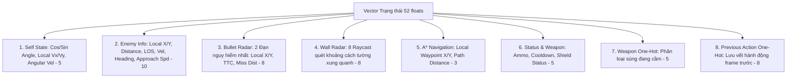

# BÁO CÁO THUẬT TOÁN & KỊCH BẢN BẢO VỆ: HỆ THỐNG TRÍ TUỆ NHÂN TẠO HỌC TĂNG CƯỜNG SÂU (PPO)

Tài liệu này tập trung **100% vào Hệ thống Trí tuệ Nhân tạo Học tăng cường sâu (Deep Reinforcement Learning - DRL)** trong **AZ Tank Game**, loại bỏ các phần bot lập trình luật thông thường và điều chỉnh chính xác cơ chế huấn luyện (đối đầu với Bot từ cấp độ 1-7 theo lộ trình tăng dần, không sử dụng Self-Play). Tài liệu cung cấp bản báo cáo chi tiết, cấu trúc slide thuyết trình và kịch bản hỏi đáp (Q&A) phục vụ cho buổi bảo vệ đồ án trước Hội đồng.

---

## PHẦN I: BÁO CÁO CHI TIẾT HỆ THỐNG AI (PPO)

Hệ thống AI trong trò chơi bắn xe tăng được xây dựng dựa trên phương pháp **Học tăng cường sâu (Deep Reinforcement Learning)**. Tác vụ điều khiển xe tăng là một bài toán ra quyết định liên tục trong môi trường vật lý 2D (cung cấp bởi Box2D). Thuật toán lõi được sử dụng là **PPO (Proximal Policy Optimization)** kết hợp với lộ trình **Học chương trình (Curriculum Learning)** đối đầu với các đối thủ máy lập trình sẵn tăng dần cấp độ để định hình hành vi chiến thuật.

---

### 1. Kiến trúc Mạng Neural & Không gian Trạng thái/Hành động

#### A. Không gian Quan sát (Observation Space - 52 chiều)
Để AI có thể ra quyết định chính xác, ta mô phỏng các "giác quan" của xe tăng dưới dạng một vector trạng thái gồm **52 số thực** được chuẩn hóa về khoảng $[-1.0, 1.0]$ hoặc $[0.0, 1.0]$:



1.  **Self State (5 chiều):** Hướng xe tăng ($\cos(\theta), \sin(\theta)$), vận tốc tuyến tính cục bộ ($V_x, V_y$), và vận tốc góc ($\omega$).
2.  **Enemy Info (10 chiều):** Vị trí tương đối của địch ($X_{rel}, Y_{rel}$), khoảng cách, trạng thái Line-of-Sight (LOS - bắn thẳng), vận tốc cục bộ địch, hướng lệch $\cos(\Delta\theta), \sin(\Delta\theta)$, tốc độ tiếp cận, và kẻ địch có nhìn thấy ta không.
3.  **Bullet Radar (8 chiều):** Quét 2 viên đạn nguy hiểm nhất đang bay về phía mình. Mỗi viên gồm: Vị trí tương đối ($X, Y$), thời gian dự kiến va chạm TTC (Time to Contact), và khoảng cách trượt tối thiểu (Miss Distance).
4.  **Wall Radar (8 chiều):** 8 tia Raycast quét khoảng cách tới tường tĩnh theo các hướng: $-135^\circ, -90^\circ, -45^\circ, 0^\circ, 45^\circ, 90^\circ, 135^\circ, 180^\circ$.
5.  **A\* Navigation (3 chiều):** Vị trí tương đối của Waypoint tiếp theo trên đường đi ngắn nhất tìm bởi A* và khoảng cách còn lại đến đích (giúp AI định hướng di chuyển trong mê cung).
6.  **Status (5 chiều):** Lượng đạn hiện tại, thời gian hồi chiêu bắn, đạn của kẻ địch, khiên có đang hoạt động hay không, thời gian hồi chiêu khiên.
7.  **Weapon Type (5 chiều):** Mã hóa One-hot cho loại vũ khí (Normal, Gatling, Frag, Missile, Death Ray).
8.  **Previous Action One-Hot (8 chiều):** Lưu vết hành động đã thực hiện ở frame trước (Move 3, Turn 3, Shoot 2) để tăng tính mượt mà và nhất quán của hành động.

#### B. Không gian Hành động (Action Space - MultiDiscrete)
Quyết định hành động đầu ra của mạng Neural được cấu hình dưới dạng MultiDiscrete `[3, 3, 2]`:
*   **Hành động Di chuyển (`Move`):** `0` = Đứng im, `1` = Tiến, `2` = Lùi.
*   **Hành động Xoay (`Turn`):** `0` = Đứng im, `1` = Xoay trái, `2` = Xoay phải.
*   **Hành động Khai hỏa (`Shoot`):** `0` = Không bắn, `1` = Bắn.

*Cơ chế khóa bắn (Action Masking):* Nhằm tiết kiệm đạn và tối ưu độ chính xác, lệnh bắn chỉ được thực thi nếu AI có đường bắn thẳng (Line of Sight) không bị chắn bởi tường tĩnh.

---

### 2. Thiết kế Hàm phần thưởng (Reward Shaping)

Để vượt qua bài toán phần thưởng thưa thớt (Sparse Reward) trong game 2D, hàm phần thưởng được cấu trúc bằng cách nhân các phần thưởng phụ với hệ số **Shaping Factor (SF)**. SF giảm dần theo thời gian huấn luyện để AI tập trung tối ưu chỉ số Kill/Death (K/D) ở giai đoạn cuối.

$$Reward = R_{time} + SF \cdot (R_{approach} + R_{aim} + R_{A^*} - P_{wall} - P_{stuck} - P_{jerk} - P_{bullet\_prox} - P_{camp} - P_{ram}) + R_{event}$$

#### A. Các phần thưởng dẫn dắt (Shaping Rewards):
*   **Thưởng tịnh tiến ($R_{approach}$):** $+0.005$ khi khoảng cách tới kẻ địch giảm; thưởng thêm khi phá vỡ kỷ lục khoảng cách gần nhất để khuyến khích AI săn đuổi.
*   **Thưởng bám đường A* ($R_{A^*}$):** $+0.008$ khi hướng đầu xe trùng với Waypoint định vị của thuật toán A* và đang tiến lên.
*   **Thưởng ngắm bắn chuẩn ($R_{aim}$):** $+0.02 \rightarrow +0.04$ khi ngắm trúng địch và khai hỏa.

#### B. Các hình phạt hành vi (Penalties):
*   **Phạt thời gian ($R_{time}$):** Phạt $-0.002$ mỗi frame để ép AI hành động quyết đoán, nhanh gọn.
*   **Phạt va chạm tường ($P_{wall}$):** Phạt $-0.005$ khi chạm tường tĩnh. Nếu nhấn ga nhưng không di chuyển (bị kẹt vào tường), phạt stuck penalty $-0.01$ để AI tự học cách lùi ra và xoay sang hướng khác.
*   **Phạt di chuyển giật cục ($P_{jerk}$):** Phạt $-0.001$ nếu đổi trạng thái di chuyển (tiến-lùi hoặc trái-phải) liên tiếp ở hai frame liền kề, giúp xe chạy mượt và thẳng đường.
*   **Phạt né đạn ($P_{bullet\_prox}$):** Phạt $-0.005 \times Proximity \times Closeness$ khi đạn địch đi sát xe tăng, ép AI phải tự học cách né đạn sườn.
*   **Phạt cắm trại ($P_{camp}$):** Phạt $-0.01$ (hoặc $-0.02$ nếu cả hai xe đứng im) khi AI đứng yên thụ động trong khi địch ở xa.
*   **Phạt húc địch ($P_{ram}$):** Phạt $-0.005$ nếu húc thẳng vào xe kẻ địch để hạn chế lối chơi liều mạng cận chiến.

#### C. Phần thưởng sự kiện lớn ($R_{event}$):
*   Tiêu diệt kẻ địch (Kill): $+5.0$
*   Bị tiêu diệt (Death): $-5.0$
*   Tự sát (bị đạn của chính mình bắn ra nảy tường quay lại trúng mình): $-10.0$ (Phạt cực nặng để AI học cách tránh đường đạn phản xạ của chính nó).

---

### 3. Chiến thuật Huấn luyện: Curriculum Learning đấu với Bot Cấp độ

Mô hình AI sử dụng mạng Neural MLP Policy với kiến trúc đơn giản:
$$\text{Input (52)} \rightarrow \text{Linear(52, 64)} \rightarrow \text{Tanh} \rightarrow \text{Linear(64, 64)} \rightarrow \text{Tanh} \rightarrow \text{Linear(64, 8)} \rightarrow \text{Logits}$$

#### A. Huấn luyện 11 giai đoạn (Curriculum Learning)
Mạng Neural kích thước nhỏ rất dễ mất các kỹ năng cũ nếu huấn luyện trực tiếp trong môi trường đầy đủ thử thách ngay từ đầu. Do đó, tiến trình huấn luyện được thiết lập theo lộ trình tăng dần độ phức tạp của bản đồ, chướng ngại vật và cấp độ đối thủ máy (Bot từ Level 1 đến Level 7):

| Phase | Môi trường | Cấp độ đối thủ (Bot Level) | Số bước (Steps) | Shaping Factor (SF) | Learning Rate (LR) | Entropy Coef |
| :---: | :---: | :---: | :---: | :---: | :---: | :---: |
| **1** | Bãi trống | Lv1 (Bia tĩnh - Đứng im hoàn toàn) | 500k | 1.00 | $3 \times 10^{-4}$ | 0.050 |
| **2** | Bãi trống | Lv2 (Chỉ chạy trốn, không bắn) | 500k | 1.00 | $3 \times 10^{-4}$ | 0.050 |
| **3** | Bãi trống | Lv3 (Bắn thụ động khi địch lọt hồng tâm)| 800k | 1.00 | $3 \times 10^{-4}$ | 0.050 |
| **4** | Bãi trống | Lv4 (Combat ngắm bắn thẳng chủ động)| 1.0M | 1.00 | $3 \times 10^{-4}$ | 0.050 |
| **5** | Mê cung | Lv4 (Combat thẳng + Bắt đầu vượt ải tường)| 1.5M | 0.90 | $2 \times 10^{-4}$ | 0.030 |
| **6** | Mê cung | Lv5 (Bot bắn nảy tường 1 lần) | 2.0M | 0.70 | $2 \times 10^{-4}$ | 0.030 |
| **7** | Mê cung | Lv6 (Bot bắn nảy tường 2 lần) | 3.0M | 0.50 | $1 \times 10^{-4}$ | 0.010 |
| **8** | Mê cung | Lv6 (Củng cố giảm Shaping Factor) | 3.0M | 0.30 | $1 \times 10^{-4}$ | 0.010 |
| **9** | Mê cung + Items| Đấu hỗn hợp Lv5 & Lv6 | 3.0M | 0.15 | $5 \times 10^{-5}$ | 0.010 |
| **10**| Mê cung + Items| Đấu ngẫu nhiên Lv4, 5, 6 chống overfit | 10.0M | 0.05 | $5 \times 10^{-5}$ | 0.005 |
| **11**| Mê cung + Items| Lv7 (Boss bắn nảy tường 4 lần) | 5.0M | 0.03 | $3 \times 10^{-5}$ | 0.003 |

#### B. Tại sao sử dụng Curriculum Learning với Bot Cấp độ thay vì Self-Play?
*   **Hội tụ nhanh và ổn định:** Đấu với các bot cấp độ lập trình sẵn (rule-based heuristic) có hành vi cụ thể giúp định hướng học rõ ràng. AI không bị rơi vào hiện tượng sụp đổ chính sách khi thay đổi môi trường.
*   **Học cuốn chiếu khoa học:** Ở mỗi giai đoạn, AI chỉ tập trung giải quyết một kỹ năng mới (ví dụ: né đạn nảy ở giai đoạn 6-7, nhặt vật phẩm hỗ trợ ở giai đoạn 9-10). Điều này giúp xây dựng nền tảng vững chắc cho mô hình trước khi bước vào ải Boss Lv7 ở Phase 11.
*   **Tránh bẫy lệch lạc hành vi:** Trong game xe tăng nảy tường, nếu dùng Self-Play từ đầu, cả hai Agent có thể tự phát triển các hành vi phi thực tế hoặc cùng đứng im để tích lũy điểm thưởng thời gian thay vì học cách chiến đấu tích cực. Việc đối đầu với các Bot có luật bắn nảy tường tối ưu hóa buộc AI phải tìm ra lời giải đối phó thực tế.

---

### 4. Triển khai Suy luận Thuần C++ (Zero-Dependency Inference)

Để tích hợp mô hình AI từ Python sang game C++ thực tế mà không cần cài đặt các framework khổng lồ như ONNX Runtime hay PyTorch (nặng hàng trăm Megabyte và khó tương thích đa nền tảng), dự án thiết kế giải pháp **Zero-Dependency Inference**:

```
[Mô hình SB3 .zip (Python)] 
       │ (Chạy export_model.py)
       ▼
[File Trọng số .bin (32 KB)]
       │ (Load trực tiếp vào RAM)
       ▼
[Forward Pass Thuần C++ (ai_bot.cpp)] ──> [Đầu ra Quyết định Actions]
```

#### A. Cấu trúc File Nhị phân Trọng số (`.bin`):
Mô hình mạng Neural nhỏ được lưu dưới dạng file nhị phân siêu gọn với định dạng:
*   `AZAI` (4 bytes magic number)
*   `Version` (uint32)
*   `NumLayers` (uint32)
*   Từng Layer bao gồm: `Rows` (uint32 - số chiều ra), `Cols` (uint32 - số chiều vào), mảng dữ liệu trọng số (`Rows * Cols * float32`), mảng bias (`Rows * float32`).

#### B. Thuật toán Forward Pass trên C++:
Forward pass được tính toán thủ công bằng toán học cơ bản:
```cpp
std::vector<float> AIBot::Forward(const std::vector<float>& input) {
    std::vector<float> x = input;
    for (size_t l = 0; l < layers.size(); l++) {
        const DenseLayer& layer = layers[l];
        std::vector<float> y(layer.rows, 0.0f);
        
        // Phép nhân ma trận y = W * x + b
        for (int r = 0; r < layer.rows; r++) {
            float sum = layer.biases[r];
            const float* w_row = &layer.weights[r * layer.cols];
            for (int c = 0; c < layer.cols; c++) {
                sum += w_row[c] * x[c];
            }
            // Hàm kích hoạt Tanh cho tầng ẩn, tầng đầu ra giữ nguyên Logits
            if (l < layers.size() - 1) {
                sum = tanhf(sum);
            }
            y[r] = sum;
        }
        x = std::move(y);
    }
    return x;
}
```
*   **Hiệu năng:** Dung lượng mô hình chỉ **32 KB**. Thời gian suy luận cực nhanh, chỉ mất **1-3 microseconds** trên CPU thông thường, tốn chưa tới $0.01\%$ quỹ thời gian của một khung hình 60 FPS.

---

## PHẦN II: KỊCH BẢN THUYẾT TRÌNH BẢO VỆ

### Slide 1: Giới thiệu Đề tài & Đặt vấn đề
*   **Nội dung:** Ứng dụng Học tăng cường sâu (Deep Reinforcement Learning) để xây dựng Trí tuệ nhân tạo tự động điều khiển xe tăng trong trò chơi 2D có môi trường vật lý va chạm phức tạp.
*   **Mục tiêu:**
    1. Huấn luyện thành công AI tự học cách né đạn, nhặt vật phẩm, tìm đường trong mê cung và tiêu diệt đối thủ bằng góc bắn nảy tường.
    2. Triển khai AI trực tiếp trong game C++ tối ưu hiệu năng và dung lượng.

### Slide 2: Thiết kế Không gian Trạng thái & Hành động của AI
*   **Nội dung:**
    *   **Trạng thái đầu vào (52 chiều):** Phân tích 8 nhóm dữ liệu cảm biến chính. Nhấn mạnh vào "Radar đạn nguy hiểm nhất" (dạy AI né tránh) và "Định vị Waypoint của A*" (dạy AI vượt mê cung).
    *   **Hành động đầu ra:** Cấu hình MultiDiscrete `[3, 3, 2]` để điều khiển đồng thời ba nhóm phím: Tiến/Lùi, Xoay Trái/Phải, và Khai hỏa. Action Masking ngăn chặn spam đạn vô nghĩa.

### Slide 3: Thiết kế Hàm phần thưởng (Reward Shaping)
*   **Nội dung:**
    *   Giới thiệu công thức tổng quát của hàm phần thưởng.
    *   Giải thích vai trò của **Shaping Factor (SF)**: Dẫn dắt AI học kỹ năng ở giai đoạn đầu ($SF=1.0$), và trả lại sự tập trung cho tỷ lệ thắng bại thực tế ở giai đoạn cuối ($SF=0.03$).
    *   Phân tích các hình phạt đột phá: Phạt di chuyển giật cục (giúp xe di chuyển mượt mà), phạt tự sát nặng gấp đôi bị tiêu diệt (giúp AI chú ý tránh đạn nảy của chính mình).

### Slide 4: Chiến thuật Huấn luyện: Curriculum Learning đấu với Bot Cấp độ
*   **Nội dung:**
    *   **Học chương trình 11 giai đoạn:** Giải thích tại sao không train AI trực tiếp trong mê cung ngay từ đầu (bị kẹt cục bộ, phần thưởng thưa thớt). Trình bày cách tăng dần độ khó của bản đồ và đối thủ (Level 1 $\rightarrow$ Level 7).
    *   **Ưu điểm:** Giúp mô hình hội tụ nhanh chóng, kiểm soát hành vi rõ ràng, đảm bảo AI học đầy đủ kỹ năng cơ bản trước khi giáp mặt với đối thủ có khả năng bắn nảy tường nâng cao.

### Slide 5: Giải pháp C++ Deployment (Zero-Dependency)
*   **Nội dung:**
    *   So sánh giải pháp dùng thư viện ONNX/PyTorch (phức tạp, cồng kềnh $\approx 50-200$MB) với giải pháp tự viết Forward Pass.
    *   Trình bày sơ đồ xuất file `.bin` (32 KB) và giải thích mã nguồn C++ thực thi nhân ma trận tuyến tính kết hợp hàm kích hoạt `tanhf`.
    *   Khẳng định hiệu năng vượt trội: Tốc độ suy luận chỉ mất 1-3 micro giây, không có độ trễ bộ nhớ GPU.

### Slide 6: Kết quả huấn luyện & Demo trực tiếp
*   **Nội dung:**
    *   Trình chiếu các biểu đồ TensorBoard (Reward tăng trưởng ổn định, độ dài ván đấu tối ưu hóa, tổn thất Policy Loss hội tụ).
    *   Trình chiếu demo trực tiếp AI đấu với người chơi hoặc đấu với Bot Level 6-7 trong mê cung. AI tự bộc lộ các hành vi thông minh: Đứng chờ phục kích góc khuất, né đạn sát sườn, bắn nảy tường để triệt hạ mục tiêu không thấy trực tiếp.

---

## PHẦN III: KỊCH BẢN HỎI ĐÁP (Q&A) TRƯỚC HỘI ĐỒNG

#### Câu hỏi 1: Tại sao nhóm chọn thuật toán PPO mà không phải là DQN (Deep Q-Network) hay DDPG?
*   **Trả lời:**
    *   DQN chỉ hoạt động tốt trong không gian hành động rời rạc nhỏ, phẳng (ví dụ như phím bấm đơn lẻ). Trong trò chơi của chúng em, xe tăng cần phối hợp đồng thời 3 phím bấm (Tiến/Lùi + Xoay + Bắn), tạo ra tổ hợp hành động rời rạc lớn ($3 \times 3 \times 2 = 18$ hành động). Việc dùng DQN sẽ khiến mạng khó hội tụ do số lượng nhánh hành động tăng lũy thừa. PPO hỗ trợ không gian MultiDiscrete, cho phép chọn hành động độc lập trên từng nhóm phím bấm vô cùng mượt mà.
    *   So với DDPG hay SAC (thuật toán cho hành động liên tục), PPO ổn định hơn rất nhiều nhờ cơ chế giới hạn cập nhật chính sách (Clipped Objective), giúp tránh được hiện tượng sụp đổ chính sách khi thay đổi môi trường đột ngột trong Curriculum Learning.

#### Câu hỏi 2: Tham số "Previous Action" (Hành động ở frame trước) trong vector đầu vào thực sự giúp gì cho AI?
*   **Trả lời:**
    *   Do kiến trúc mạng Neural Policy của chúng em là MLP (Multi-Layer Perceptron) thông thường, nó không có bộ nhớ về quá khứ (không giống như RNN hay LSTM).
    *   Nếu không có hành động frame trước làm đầu vào, AI sẽ chỉ quyết định hành động dựa trên ảnh chụp tĩnh của frame hiện tại. Điều này dễ dẫn đến việc AI đưa ra các hành động mâu thuẫn liên tiếp (ví dụ: frame này nhấn Tiến, ngay frame sau nhấn Lùi, tạo ra hành động giật cục vô nghĩa tại chỗ).
    *   Bằng việc đưa hành động frame trước vào trạng thái, AI nhận thức được "ở tích tắc trước mình đang tiến/lùi/xoay hướng nào". Từ đó nó học được tính nhất quán của hành động, di chuyển mượt mà hơn và hạn chế rung lắc.

#### Câu hỏi 3: Hãy giải thích cách thiết kế hàm phần thưởng né đạn (Bullet Proximity Penalty). Tại sao nó giúp AI né được đạn thay vì bị hoảng loạn?
*   **Trả lời:**
    *   Hình phạt né đạn được thiết kế dựa trên khoảng cách vuông góc tối thiểu từ tâm xe tăng đến quỹ đạo bay của đạn địch ($P_{bullet\_prox} = -0.005 \times Proximity \times Closeness$).
    *   Nếu chỉ phạt khi bị trúng đạn (Death Penalty), AI sẽ không biết mình làm sai ở đâu vì sự kiện chết xảy ra rất thưa thớt.
    *   Hình phạt tiệm cận này đóng vai trò như một trường lực ảo cảnh báo. Khi đạn bay sát sườn, AI bị trừ điểm nhẹ. Hướng né tránh tối ưu (để giảm hình phạt này về 0 nhanh nhất) là di chuyển theo hướng vuông góc với đường bay của đạn. Nhờ đó, AI tự động học được kỹ năng nghiêng mình né đạn (Sidestep) cực kỳ thông minh mà không cần chúng em phải lập trình bất kỳ một dòng code luật né tránh nào.

#### Câu hỏi 4: Trong mê cung có rất nhiều vật cản tĩnh làm chặn tầm nhìn của AI. AI định vị kẻ địch và tìm đường đi như thế nào?
*   **Trả lời:**
    *   Trong mê cung, nếu chỉ dựa vào khoảng cách Euclid (đường thẳng), AI sẽ liên tục húc đầu vào tường để cố đi thẳng tới địch.
    *   Để giải quyết vấn đề này, chúng em đã tích hợp thuật toán tìm đường **A\*** chạy song song trong lõi game. A* sẽ tìm đường đi ngắn nhất vòng qua các chướng ngại vật để tới vị trí địch và cung cấp tọa độ của điểm chuyển hướng tiếp theo (Waypoint).
    *   Chúng em đưa tọa độ tương đối của Waypoint này ($X_{wp}, Y_{wp}$) và khoảng cách đường đi A* vào vector trạng thái của AI (Nhóm 5 - A* Navigation). Đồng thời, thiết kế phần thưởng bám đường A* ($R_{A^*}$). Kết quả là AI tự học cách lái xe men theo các chỉ dẫn của Waypoint để tiếp cận kẻ địch hiệu quả nhất, giải quyết triệt để bài toán tìm đường trong mê cung phức tạp.

#### Câu hỏi 5: Tại sao việc suy luận (inference) thuần C++ lại nhanh hơn và tối ưu hơn nhiều so với ONNX Runtime, trong khi ONNX Runtime đã được tối ưu hóa cực mạnh?
*   **Trả lời:**
    *   ONNX Runtime được tối ưu hóa rất tốt cho các mô hình lớn (như ResNet, BERT) với nhiều cơ chế tối ưu đa luồng và tăng tốc phần cứng (GPU).
    *   Tuy nhiên, mô hình AI của chúng em là một mạng MLP cực nhỏ (chỉ có khoảng 8.000 tham số). Với mô hình siêu nhỏ này, thời gian chuẩn bị dữ liệu, gọi API qua wrapper C++ và chuyển dữ liệu giữa các luồng của ONNX Runtime (overhead) còn tốn thời gian hơn cả thời gian tính toán thực tế của mạng.
    *   Bằng cách tự viết hàm forward pass thuần C++ chạy trực tiếp trên RAM của game thread, chúng em loại bỏ hoàn toàn các chi phí quản lý trung gian đó. Phép nhân ma trận được compiler tối ưu hóa thẳng thành các tập lệnh SSE/AVX trên CPU, mang lại tốc độ suy luận tức thời (1-3 microseconds) và giữ dung lượng game siêu nhẹ (chỉ tăng thêm đúng 32 KB trọng số).
