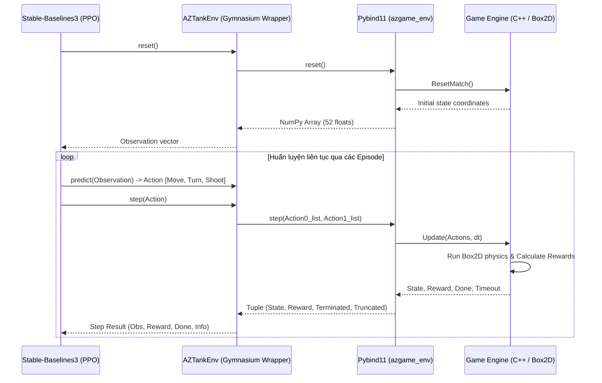

# BÁO CÁO DỰ ÁN: HUẤN LUYỆN AI XE TĂNG ĐỐI KHÁNG (AZ TANK GAME)
### Môn học: IT3160 - Giới thiệu Trí tuệ nhân tạo / Dự án CNTT
**Sinh viên thực hiện**: [Điền tên của bạn]
**Mã số sinh viên**: [Điền MSSV của bạn]
**Giảng viên hướng dẫn**: [Điền tên GVHD của bạn]

---

## MỤC LỤC

- [1 Giới thiệu đề tài](#1-giới-thiệu-đề-tài)
  - [1.1 Lý do chọn đề tài](#11-lý-do-chọn-đề-tài)
  - [1.2 Mục tiêu của bài tập lớn](#12-mục-tiêu-của-bài-tập-lớn)
    - [1.2.1 Mục tiêu nghiên cứu](#121-mục-tiêu-nghiên-cứu)
    - [1.2.2 Mục tiêu kỹ thuật](#122-mục-tiêu-kỹ-thuật)
    - [1.2.3 Mục tiêu đánh giá](#123-mục-tiêu-đánh-giá)
- [2 Phân tích bài toán](#2-phân-tích-bài-toán)
  - [2.1 Giới thiệu môi trường trò chơi](#21-giới-thiệu-môi-trường-trò-chơi)
  - [2.2 Đặc điểm môi trường bài toán](#22-đặc-điểm-môi-trường-bài-toán)
  - [2.3 Xác định trạng thái (State)](#23-xác-định-trạng-thái-state)
  - [2.4 Bộ phân hành động (Action Space)](#24-bộ-phân-hành-động-action-space)
  - [2.5 Hệ thống phần thưởng (Reward System)](#25-hệ-thống-phần-thưởng-reward-system)
  - [2.6 Phân tích và nhận xét](#26-phân-tích-và-nhận-xét)
- [3 Cơ sở lý thuyết và thuật toán](#3-cơ-sở-lý-thuyết-và-thuật-toán)
  - [3.1 Tổng quan về Học tăng cường (Reinforcement Learning)](#31-tổng-quan-về-học-tăng-cường-reinforcement-learning)
  - [3.2 Thuật toán PPO (Proximal Policy Optimization)](#32-thuật-toán-ppo-proximal-policy-optimization)
  - [3.3 Ước lượng lợi thế GAE (Generalized Advantage Estimation)](#33-ước-lượng-lợi-thế-gae-generalized-advantage-estimation)
- [4 Thiết kế và cài đặt hệ thống](#4-thiết-kế-và-cài-đặt-hệ-thống)
  - [4.1 Kiến trúc và luồng hoạt động thuật toán PPO trong dự án](#41-kiến-trúc-và-luồng-hoạt-động-thuật-toán-ppo-trong-dự-án)
  - [4.2 Cài đặt chi tiết mô hình PPO](#42-cài-đặt-chi-tiết-mô-hình-ppo)
    - [4.2.1 Kiến trúc mạng (MLP Policy)](#421-kiến-trúc-mạng-mlp-policy)
    - [4.2.2 Hàm mất mát tổng thể (Total Loss)](#422-hàm-mất-mát-tổng-thể-total-loss)
    - [4.2.3 Lộ trình huấn luyện lũy tiến (Curriculum Learning)](#423-lộ-trình-huấn-luyện-lũy-tiến-curriculum-learning)
    - [4.2.4 Cơ chế tự đối đầu (Self-Play) và OpponentPool](#424-cơ-cơ-chế-tự-đối-đầu-self-play-và-opponentpool)
  - [4.3 Cài đặt Bot luật (C++ Rule-Based Bot) đối thủ](#43-cài-đặt-bot-luật-c-rule-based-bot-đối-thủ)
    - [4.3.1 Kiến trúc đa luồng](#431-kiến-trúc-đa-luồng)
    - [4.3.2 Hệ thống cảm biến (Sensors)](#432-hệ-thống-cảm-biến-sensors)
    - [4.3.3 Thuật toán lái đường (Pure Pursuit & Corridor Center-Seeking)](#433-thuật-toán-lái-đường-pure-pursuit-corridor-center-seeking)
    - [4.3.4 Thuật toán né đạn (Dodge System)](#434-thuật-toán-né-đạn-dodge-system)
    - [4.3.5 Thuật toán bắn nảy tường (FindBounce)](#435-thuật-toán-bắn-nảy-tường-findbounce)
    - [4.3.6 Phân loại cấp độ Bot đối thủ (Levels 1 - 7)](#436-phân-loại-cấp-độ-bot-đối-thủ-levels-1---7)
- [5 Kết quả, đánh giá](#5-kết-quả-đánh-giá)
  - [5.1 Kết quả thực nghiệm](#51-kết-quả-thực-nghiệm)
    - [5.1.1 Các kỹ năng học được của Agent](#511-các-kỹ-năng-học-được-của-agent)
    - [5.1.2 Cấu hình và hiệu suất huấn luyện](#512-cấu-hình-và-hiệu-suất-huấn-luyện)
- [6 Kết luận và hướng phát triển](#6-kết-luận-và-hướng-phát-triển)
  - [6.1 Kết luận](#61-kết-luận)
  - [6.2 Hướng phát triển](#62-hướng-phát-triển)
- [7 Tài liệu tham khảo](#7-tài-liệu-tham-khảo)

---

## 1 Giới thiệu đề tài

### 1.1 Lý do chọn đề tài
Trong những năm gần đây, Học tăng cường (Reinforcement Learning - RL) đã đạt được nhiều bước tiến lớn, mở ra khả năng tự giải quyết các bài toán điều khiển phức tạp thông qua tương tác liên tục với môi trường. Các trò chơi đối kháng thời gian thực (Real-time Combat Games) là môi trường thử nghiệm lý tưởng cho các thuật toán RL nhờ tính động, yêu cầu ra quyết định tốc độ cao và khả năng áp dụng các kỹ năng chiến thuật linh hoạt.

Dự án **AZ Tank Game** là trò chơi đối kháng xe tăng 2D được xây dựng trên nền tảng thư viện vật lý Box2D. Trò chơi sở hữu các cơ chế đặc trưng bao gồm: mê cung tạo ngẫu nhiên, các cổng dịch chuyển không gian (portals), các hộp vật phẩm cung cấp vũ khí đặc biệt (Gatling, Frag Bomb, Homing Missile, Death Ray) và cơ chế đạn nảy độc đáo khi va chạm tường. Việc phát triển một xe tăng tự hành thông minh bằng phương pháp lập trình luật truyền thống (Rule-based) đòi hỏi cấu trúc điều kiện cực kỳ cồng kềnh, dễ bị bắt bài và thiếu khả năng thích nghi với môi trường mới.

Do đó, đề tài tập trung nghiên cứu áp dụng thuật toán **PPO (Proximal Policy Optimization)** để đào tạo một tác nhân (Agent) tự hành có khả năng tự học các hành vi chiến thuật từ con số 0: di chuyển linh hoạt trong mê cung, chủ động né đạn kẻ địch, nhặt vật phẩm hỗ trợ và tận dụng địa hình để tiêu diệt đối thủ thông qua các góc bắn đạn nảy gián tiếp.

> **[HÌNH ẢNH 1]**: *Ảnh chụp giao diện đồ họa thực tế của AZ Tank Game khi hai xe tăng đối chiến trong mê cung với đạn bay và cổng dịch chuyển.*

---

### 1.2 Mục tiêu của bài tập lớn

#### 1.2.1 Mục tiêu nghiên cứu
- Nghiên cứu sâu cơ sở lý thuyết của Học tăng cường trong không gian hành động rời rạc/hỗn hợp và thuật toán **PPO (Proximal Policy Optimization)** kết hợp với cơ chế **GAE (Generalized Advantage Estimation)**.
- Tìm hiểu và áp dụng kỹ thuật tạo hình phần thưởng (**Reward Shaping**) để khắc phục bài toán phần thưởng thưa thớt (sparse rewards) trong không gian mê cung.
- Nghiên cứu phương pháp huấn luyện lũy tiến (**Curriculum Learning**) kết hợp kỹ thuật tự đối đầu (**Self-Play**) để cải thiện chất lượng chính sách huấn luyện của mô hình.

#### 1.2.2 Mục tiêu kỹ thuật
- Tích hợp lõi vật lý trò chơi được viết bằng ngôn ngữ **C++/Box2D** với môi trường **Gymnasium** của Python thông qua thư viện liên kết **Pybind11**, đảm bảo tốc độ truyền nhận dữ liệu ở mức tối ưu.
- Thiết kế không gian quan sát (52 chiều) và không gian hành động phù hợp để mô hình nắm bắt đầy đủ thông tin môi trường xung quanh.
- Xây dựng hệ thống huấn luyện đa luồng (Headless Mode) chạy hoàn toàn trên CPU nhằm tăng tốc lấy mẫu dữ liệu, tối ưu hóa băng thông mà không gặp hiện tượng nghẽn cổ chai RAM-VRAM trên GPU.
- Triển khai tiến trình Curriculum Learning gồm **11 giai đoạn** tương ứng với các cấp độ bot đối thủ từ bia đứng yên đến bot bắn tỉa nảy tường cấp độ tối đa (Level 7).

#### 1.2.3 Mục tiêu đánh giá
- Đo lường và vẽ biểu đồ quá trình hội tụ của phần thưởng tích lũy (Cumulative Reward), hàm mất mát giá trị (Value Loss) và độ dài của mỗi Episode trong quá trình huấn luyện qua các giai đoạn.
- Đánh giá chất lượng của mô hình AI khi chiến đấu trực quan chống lại các Bot luật (Rule-Based Bots) từ dễ đến khó và khi đối đầu với chính các phiên bản cũ của mình.

---

## 2 Phân tích bài toán

### 2.1 Giới thiệu môi trường trò chơi
Môi trường **AZ Tank Game** là một thế giới 2D giới hạn kích thước ($960 \times 720$ pixels). Lõi vật lý được tính toán bằng Box2D với hệ số tỉ lệ $SCALE = 30.0f$ (1 mét trong Box2D tương đương 30 pixels).
Bản đồ bao gồm hệ thống tường gạch và tường gỗ được tạo ngẫu nhiên. Hai xe tăng (AI của người học và đối thủ) sẽ thi đấu đối kháng trực tiếp. Đạn được bắn ra từ xe tăng sẽ nảy khi va chạm với các cạnh tường. Ngoài ra, trên bản đồ sẽ xuất hiện ngẫu nhiên:
- **Hộp vật phẩm hỗ trợ**: Cho phép xe tăng sở hữu vũ khí đặc biệt (Gatling, Frag Bomb, Homing Missile, Death Ray) hoặc kích hoạt khiên chắn vật lý.
- **Cổng dịch chuyển (Portals)**: Gồm 2 cổng liên kết với nhau. Khi xe tăng hoặc đạn đi vào cổng A, nó sẽ tức thời xuất hiện tại cổng B với cùng hướng vận tốc.

---

### 2.2 Đặc điểm môi trường bài toán
- **Môi trường thời gian thực (Real-time)**: Game chạy ở tần số mô phỏng vật lý cố định 60 FPS ($dt = 1/60$ giây). Tác nhân phải ra quyết định liên tục ở mỗi bước thời gian.
- **Tính ngẫu nhiên cao (Stochasticity)**: Mỗi ván chơi sinh một mê cung mới bằng thuật toán *Recursive Backtracker*. Vị trí xuất hiện của 2 xe tăng, cổng dịch chuyển và hộp vật phẩm cũng thay đổi ngẫu nhiên.
- **Quan sát cục bộ (Local Observability)**: Thay vì sử dụng hình ảnh thô toàn màn hình (gây nặng và tốn tài nguyên huấn luyện), tác nhân sử dụng thông tin cảm biến tọa độ tương đối từ chính nó để tối ưu hóa khả năng khái quát hóa.

---

### 2.3 Xác định trạng thái (State)
Trạng thái quan sát (Observation Space) cung cấp cho mô hình AI là một vector **52 chiều** chứa các giá trị số thực đã chuẩn hóa về khoảng $[-1.0, 1.0]$. Cụ thể cấu trúc vector quan sát như sau:

| Chỉ số | Nhóm thông tin | Số lượng chiều | Mô tả chi tiết giá trị và công thức chuẩn hóa |
|:---:|---|:---:|---|
| **0 -> 4** | **Self State** | 5 | Trạng thái bản thân: Hướng xoay ($\cos\theta$, $\sin\theta$), vận tốc tuyến tính cục bộ ($V_x / 3.0$, $V_y / 3.0$), vận tốc góc ($\omega / 3.0$) chuẩn hóa theo vận tốc tối đa $3.0$ m/s trong Box2D. |
| **5 -> 14** | **Enemy Info** | 10 | Thông tin kẻ địch: Tọa độ tương đối ($X / L_{max}$, $Y / L_{max}$), khoảng cách tương đối ($d / L_{max}$ với $L_{max}$ là chiều dài tia chéo màn hình), chỉ số tầm nhìn thẳng (Line of Sight - 1.0 nếu thấy địch, 0.0 nếu bị tường chắn), vận tốc tuyến tính cục bộ của địch ($V_{ex}/3.0$, $V_{ey}/3.0$), hiệu hướng xoay tương đối ($\cos(\theta_e - \theta_m)$, $\sin(\theta_e - \theta_m)$), tốc độ áp sát (Approach Speed) và chỉ số kẻ địch có nhìn thấy mình không. |
| **15 -> 22** | **Bullet Radar** | 8 | Radar giám sát 2 viên đạn nguy hiểm nhất đang bay về phía mình. Mỗi viên gồm 4 tham số: Vị trí tương đối ($X/L_{max}$, $Y/L_{max}$), thời gian va chạm ước tính (Time To Collision - TTC, chuẩn hóa trong khoảng $[0.0, 1.0]$ với tối đa 5 giây) và khoảng cách trượt nhỏ nhất (Miss Distance). |
| **23 -> 30** | **Wall Radar** | 8 | Radar khoảng cách tới chướng ngại vật (tường tĩnh) theo 8 hướng quét tương đối xung quanh xe tăng: $-135^\circ, -90^\circ, -45^\circ, 0^\circ, 45^\circ, 90^\circ, 135^\circ, 180^\circ$. Giá trị trả về là tỉ lệ khoảng cách va chạm ($fraction \in [0, 1]$). |
| **31 -> 33** | **A\* Navigation** | 3 | Dẫn đường đường đi tối ưu tìm bằng thuật toán A*: Tọa độ waypoint tiếp theo ($X/L_{max}$, $Y/L_{max}$) và khoảng cách đường đi thực tế tới kẻ địch qua các ô lưới (chuẩn hóa theo kích thước lưới tối đa $48.0$). |
| **34 -> 38** | **Status** | 5 | Trạng thái tài nguyên: Số lượng đạn đặc biệt hiện tại của mình ($\text{ammo}/5.0$), trạng thái hồi chiêu nòng súng ($1.0 - \text{cooldown}/0.5$), số đạn đặc biệt của đối thủ, trạng thái khiên hoạt động (1.0 nếu có khiên, 0.0 nếu không) và trạng thái hồi khiên của mình. |
| **39 -> 43** | **Weapon Type** | 5 | Vector One-Hot của loại vũ khí đang trang bị: [Normal, Gatling, Frag, Missile, Death Ray]. |
| **44 -> 51** | **Previous Action** | 8 | Vector One-Hot của tổ hợp hành động ở bước thời gian trước đó (Move: 3 chiều, Turn: 3 chiều, Shoot: 2 chiều), giúp mô hình duy trì tính liên tục và mượt mà của hành vi di chuyển. |

> **[HÌNH ẢNH 2]**: *Sơ đồ trực quan hóa hệ thống cảm biến của xe tăng AI: gồm 8 hướng Wall Radar quét tường, 2 tia giám sát đạn nguy hiểm nhất (Bullet Radar) và góc định vị Waypoint tiếp theo từ A*.*

---

### 2.4 Bộ phân hành động (Action Space)
Để tương thích tốt nhất với cấu trúc mạng nơ-ron rời rạc, hành động của xe tăng được thiết kế dưới dạng không gian **MultiDiscrete([3, 3, 2])**, tương ứng với việc nhấn đồng thời 3 nhóm phím điều khiển độc lập:
1. **Di chuyển tuyến tính (Move)**:
   - `0`: Đứng yên.
   - `1`: Tiến lên phía trước.
   - `2`: Lùi lại phía sau.
2. **Xoay thân xe (Turn)**:
   - `0`: Không xoay.
   - `1`: Xoay trái (ngược chiều kim đồng hồ).
   - `2`: Xoay phải (xuôi chiều kim đồng hồ).
3. **Kích hoạt phát bắn (Shoot)**:
   - `0`: Giữ súng (không bắn).
   - `1`: Phát lệnh bắn đạn.

---

### 2.5 Hệ thống phần thưởng (Reward System)
Thiết kế hàm phần thưởng là yếu tố quan trọng nhất quyết định sự hội tụ của mô hình. Trong [rl_env_wrapper.cpp](file:///c:/Users/Admin/Downloads/AZgame-hung%20%281%29/AZgame-hung/rl_env_wrapper.cpp), hệ thống phần thưởng sử dụng kỹ thuật **Reward Shaping** để dẫn dắt hành vi của xe tăng. Tất cả các phần thưởng nhỏ dẫn dắt được nhân với hệ số điều hướng $SF$ (Shaping Factor) để giảm dần tầm ảnh hưởng ở các giai đoạn cuối, giúp mô hình tập trung hoàn toàn vào kết quả thắng/thua cuối cùng.

#### 2.5.1 Nhóm phần thưởng mục tiêu cốt lõi (Sparse Rewards)
- **Tiêu diệt kẻ địch**: $+5.0$ (Tăng điểm số).
- **Bị kẻ địch tiêu diệt**: $-5.0$ (Bị hạ gục).
- **Tự sát**: $-10.0$ (Phạt rất nặng khi đạn của chính mình nảy tường quay lại bắn trúng thân xe).

#### 2.5.2 Nhóm phần thưởng điều hướng và di chuyển (Dense Rewards)
- **Time Penalty**: Phạt tích lũy mỗi step: $-0.002 \times \max(0.1, SF)$ để kích thích xe tăng tìm cách kết thúc trận đấu nhanh nhất có thể.
- **Approaching Reward (Thưởng áp sát)**: 
  - Cộng liên tục $+0.005 \times SF$ nếu khoảng cách A* tới kẻ địch ở bước này ngắn hơn bước trước.
  - Thưởng chênh lệch đột phá: cộng bonus $(d_{min} - d) \times 0.02 \times SF$ bất kỳ khi nào xe tăng phá vỡ kỷ lục khoảng cách gần nhất so với địch trong episode.
- **A\* Waypoint Following**: Cộng $+0.008 \times SF$ nếu xe tăng đang xoay mặt trực diện về phía Waypoint tiếp theo của đường dẫn A* ($\cos(\theta_{wp\_relative}) > 0.7$) và đồng thời đang nhấn lệnh tiến (`Move = 1`).

#### 2.5.3 Nhóm hình phạt va chạm và tránh kẹt
- **Phạt đâm tường**: $-0.005 \times SF$ ở mỗi step nếu thân xe va chạm với tường tĩnh.
- **Stuck Penalty (Kẹt góc)**: Phạt thêm $-0.01 \times SF$ nếu AI liên tục phát lệnh di chuyển (tiến hoặc lùi) nhưng vận tốc tuyến tính thực tế của xe tăng cực kỳ nhỏ ($V < 0.2$ m/s) trong lúc đang chạm tường. Điều này ép AI phải biết lùi ra và xoay sang hướng khác để thoát kẹt.
- **Camping Penalty (Trừng phạt đứng yên thụ động)**:
  - Nếu AI di chuyển trong phạm vi dưới $30$ pixels suốt 60 frame liên tục và khoảng cách đến kẻ địch lớn hơn $240$ pixels: phạt $-0.01 \times SF$.
  - Nếu cả hai xe tăng đều đứng yên cùng lúc (gây bế tắc trận đấu): phạt nặng $-0.02 \times SF$.
- **Ramming Penalty (Phạt đâm húc)**: Phạt $-0.005 \times SF$ nếu xe tăng đâm trực tiếp vào xe tăng đối thủ (tránh hành vi đâm tự sát không cần thiết).
- **Jerky Movement Penalty (Giật cục chuyển động)**: Phạt $-0.001 \times SF$ nếu AI liên tục đổi chiều quay (trái sang phải) hoặc đổi chiều di chuyển (tiến sang lùi) giữa 2 frame liên tiếp, giúp xe tăng di chuyển mượt mà hơn.

#### 2.5.4 Nhóm phần thưởng chiến đấu và né đạn
- **Facing Target & Shoot (Thưởng bắn chuẩn)**: Thưởng $+0.02 + \max(0.0, \cos(\theta) \times 0.02) \times SF$ khi phát lệnh bắn lúc kẻ địch đang nằm trong tầm nhìn thẳng (LoS), với điểm thưởng tăng lên nếu góc lệch nòng súng tới mục tiêu càng gần 0.
- **Spam Penalty (Phạt bắn mù)**: Phạt $-0.03 \times SF$ nếu phát lệnh bắn khi kẻ địch không nằm trong tầm nhìn thẳng, hạn chế việc lãng phí đạn và tự sát do đạn nảy lung tung.
- **Bullet Proximity Penalty (Né đạn chủ động)**: Khi phát hiện đạn địch bay về phía mình trong phạm vi $8.0$ mét (Box2D), phạt một lượng từ $0$ đến $-0.005 \times SF$ tỉ lệ thuận với mức độ nguy hiểm:
  $$\text{Penalty} = -0.005 \times \text{closeness} \times \text{proximity} \times SF$$
  Trong đó $\text{closeness} = 1 - \frac{\text{dist}}{8.0}$ và $\text{proximity} = 1 - \frac{\text{perpDist}}{2.5}$ (khoảng cách vuông góc tới đường đi của đạn).
- **Rush Reward (Đột kích)**: Thưởng $+0.01 \times SF$ khi AI tiến thẳng về phía kẻ địch đang đứng yên ngắm bắn tỉa, khuyến khích AI chủ động áp sát phá thế ngắm bắn của địch.
- **Evasion Mode Survival**: Trong chế độ huấn luyện né đạn (không có vũ khí), sống sót hết thời gian quy định sẽ được thưởng lớn $+5.0$. Nếu bị đạn bắn trúng hoặc hết giờ trong chế độ chiến đấu, phạt timeout từ $-1.0$ đến $-3.0$ dựa vào khoảng cách tới địch (phạt nặng hơn nếu ở quá xa, trốn tránh giao tranh).

---

### 2.6 Phân tích và nhận xét
Thiết kế trạng thái kết hợp cảm biến tia quét cục bộ với tọa độ waypoint từ thuật toán tìm đường A* giúp tác nhân học được khả năng điều hướng tối ưu trong mê cung phức tạp mà không bị phụ thuộc vào kích thước bản đồ. 
Hệ thống phần thưởng phân cấp và sử dụng hệ số suy giảm $SF$ giúp giải quyết triệt để sự mâu thuẫn giữa hành vi cục bộ (muốn né tường, nhặt đồ) và mục tiêu toàn cục (tiêu diệt đối thủ).

---

## 3 Cơ sở lý thuyết và thuật toán

### 3.1 Tổng quan về Học tăng cường (Reinforcement Learning)
Học tăng cường mô tả quá trình tương tác giữa tác nhân (Agent) và môi trường (Environment) dưới dạng một Tiến trình Quyết định Markov (Markov Decision Process - MDP) bao gồm bộ 5 tham số $(S, A, P, R, \gamma)$:
- $S$: Không gian trạng thái.
- $A$: Không gian hành động.
- $P(S_{t+1}|S_t, A_t)$: Xác suất chuyển trạng thái.
- $R(S_t, A_t)$: Hàm phần thưởng nhận được.
- $\gamma \in [0, 1)$: Hệ số chiết khấu phần thưởng trong tương lai.

Mục tiêu của tác nhân là tìm kiếm một chính sách (policy) $\pi(a|s)$ tối ưu hóa tổng lượng phần thưởng tích lũy kỳ vọng dài hạn:
$$J(\pi) = \mathbb{E}_{\tau \sim \pi} \left[ \sum_{t=0}^{\infty} \gamma^t R(s_t, a_t) \right]$$

---

### 3.2 Thuật toán PPO (Proximal Policy Optimization)
PPO là thuật toán học tăng cường thuộc nhóm Policy Gradient, hoạt động theo kiến trúc Actor-Critic (Tác nhân - Phê bình). Mạng Actor chịu trách nhiệm dự đoán phân phối hành động $\pi_\theta(a|s)$, mạng Critic xấp xỉ hàm giá trị trạng thái $V_\phi(s)$ để đánh giá mức độ tốt của trạng thái hiện tại.

PPO giải quyết vấn đề bất ổn định của các phương pháp Policy Gradient truyền thống (chính sách mới thay đổi quá xa so với chính sách cũ gây sụp đổ hiệu năng) bằng cách sử dụng hàm mục tiêu cắt (Clipped Surrogate Objective):

$$L^{CLIP}(\theta) = \hat{\mathbb{E}}_t \left[ \min\left( r_t(\theta)\hat{A}_t, \text{clip}(r_t(\theta), 1-\epsilon, 1+\epsilon)\hat{A}_t \right) \right]$$

Trong đó:
- $r_t(\theta) = \frac{\pi_\theta(a_t|s_t)}{\pi_{\theta_{old}}(a_t|s_t)}$ đại diện cho tỷ lệ xác suất thực hiện hành động giữa chính sách mới và chính sách cũ.
- $\epsilon$ là tham số cắt (thường cấu hình bằng $0.2$).
- $\hat{A}_t$ là giá trị lợi thế (Advantage Value), đo lường mức độ hiệu quả của hành động được chọn so với giá trị trung bình kỳ vọng của trạng thái.

---

### 3.3 Ước lượng lợi thế GAE (Generalized Advantage Estimation)
Ước lượng lợi thế GAE giúp tính toán $\hat{A}_t$ một cách cân bằng nhất giữa phương sai (variance) và độ chệch (bias) bằng cách kết hợp sai số Temporal Difference (TD-error) đa bước thông qua tham số điều hòa $\lambda \in [0, 1]$:

$$\hat{A}_t^{GAE(\gamma, \lambda)} = \sum_{l=0}^\infty (\gamma \lambda)^l \delta_{t+l}^V$$

Với $\delta_t^V = r_t + \gamma V(s_{t+1}) - V(s_t)$ là sai số TD-error tại bước thời gian $t$. Giá trị $\lambda = 0.95$ và $\gamma = 0.99$ là cấu hình tiêu chuẩn giúp quá trình hội tụ diễn ra ổn định nhất.

---

## 4 Thiết kế và cài đặt hệ thống

### 4.1 Kiến trúc và luồng hoạt động thuật toán PPO trong dự án
Hệ thống sử dụng thư viện kết nối **Pybind11** để biên dịch lõi mô phỏng game viết bằng C++ thành thư viện nhị phân Python `.pyd` với tên gọi `azgame_env`. 
Lớp Gymnasium wrapper `AZTankEnv` trong Python sẽ gọi trực tiếp các hàm cập nhật vật lý của C++ để tính toán trạng thái và phần thưởng, sau đó đóng gói dữ liệu cung cấp cho thư viện học máy **Stable-Baselines3 (SB3)** thực hiện cập nhật mạng nơ-ron.

---

### 4.2 Cài đặt chi tiết mô hình PPO

#### 4.2.1 Kiến trúc mạng (MLP Policy)
Mô hình sử dụng mạng kết nối đầy đủ **MLP (Multi-Layer Perceptron)** dạng `MlpPolicy` từ Stable-Baselines3. 
- **Đầu vào (Input)**: Vector đặc trưng 52 chiều.
- **Tầng ẩn (Hidden Layers)**: Gồm 2 tầng ẩn kết nối đầy đủ, mỗi tầng có kích thước $64$ hoặc $128$ nơ-ron sử dụng hàm kích hoạt tanh.
- **Đầu ra (Output)**: Phân phối xác suất trên 3 nhánh hành động rời rạc (MultiDiscrete): Move (3 giá trị), Turn (3 giá trị), Shoot (2 giá trị).

Do kích thước mạng nơ-ron rất nhỏ nhưng tần số lấy mẫu yêu cầu cực lớn (do game chạy ở 60 FPS), việc tính toán lan truyền xuôi và ngược được cấu hình chạy trực tiếp trên **CPU**. Điều này loại bỏ hoàn toàn độ trễ sao chép dữ liệu trạng thái qua lại giữa RAM (hệ thống) và VRAM (card đồ họa), mang lại tốc độ huấn luyện thực tế vượt trội.

---

#### 4.2.2 Hàm mất mát tổng thể (Total Loss)
Hàm mất mát của PPO được tối ưu hóa đồng thời qua 3 thành phần:
$$L^{PPO}(\theta, \phi) = L^{CLIP}(\theta) - c_1 L^{VF}(\phi) + c_2 S[\pi_\theta](s_t)$$

Trong đó:
- $L^{VF}(\phi) = \hat{\mathbb{E}}_t \left[ (V_\phi(s_t) - V^{target}_t)^2 \right]$ là sai số bình phương trung bình xấp xỉ giá trị của Critic.
- $S[\pi_\theta](s_t)$ là entropy của chính sách, khuyến khích mô hình duy trì tính khám phá ngẫu nhiên ở các bước ban đầu để tránh rơi vào tối ưu cục bộ.
- Các hệ số mặc định: $c_1 = 0.5$ (trọng số Critic loss), $c_2 = 0.01$ hoặc thay đổi theo giai đoạn huấn luyện (trọng số Entropy).

---

#### 4.2.3 Lộ trình huấn luyện lũy tiến (Curriculum Learning)
Môi trường gồm mê cung phức tạp, đạn nảy tường và các cơ chế phụ trợ khiến cho việc huấn luyện từ đầu với một Bot mạnh là bất khả thi (Agent luôn bị tiêu diệt và không nhận được bất kỳ tín hiệu phần thưởng tích cực nào). 
Do đó, dự án thiết lập một lộ trình huấn luyện lũy tiến gồm **11 giai đoạn** chi tiết trong [train_ai.py](file:///c:/Users/Admin/Downloads/AZgame-hung%20%281%29/AZgame-hung/train_AI/train_ai.py):

| Phase | Bản đồ (Map) | Vật phẩm (Items) | Cấp độ Bot đối thủ (Bot Level) | Số bước (Steps Target) | Hệ số dẫn dắt (Shaping Factor) | Tốc độ học (Learning Rate) | Hệ số khám phá (Entropy Coef) | Mục tiêu huấn luyện & Hành vi cần đạt |
|:---:|:---:|:---:|:---:|:---:|:---:|:---:|:---:|---|
| **1** | ❌ | ❌ | `[1]` (Bia đứng yên) | 500,000 | 1.0 | $3 \times 10^{-4}$ | 0.05 | Học cách lái xe tăng cơ bản và hướng nòng bắn trực diện vào mục tiêu tĩnh. |
| **2** | ❌ | ❌ | `[2]` (Di chuyển không bắn) | 500,000 | 1.0 | $3 \times 10^{-4}$ | 0.05 | Tập bám đuổi và ngắm bắn mục tiêu di động trên bãi trống. |
| **3** | ❌ | ❌ | `[3]` (Bắn thụ động) | 800,000 | 1.0 | $3 \times 10^{-4}$ | 0.05 | Học cách vừa bám đuổi vừa né tránh các loạt đạn bắn ra từ đối thủ. |
| **4** | ❌ | ❌ | `[4]` (Combat thẳng chủ động) | 1,000,000 | 1.0 | $3 \times 10^{-4}$ | 0.05 | Giao tranh đối kháng trực diện trên bãi trống không chướng ngại vật. |
| **5** | ✅ | ❌ | `[4]` (Combat thẳng + Mê cung) | 1,500,000 | 0.9 | $2 \times 10^{-4}$ | 0.03 | Làm quen với môi trường mê cung gỗ/gạch. Tự tìm đường bằng A*. |
| **6** | ✅ | ❌ | `[5]` (Bot nảy đạn 1 lần) | 2,000,000 | 0.7 | $2 \times 10^{-4}$ | 0.03 | Thích nghi với cơ chế đạn nảy tường góc hẹp của đối thủ. |
| **7** | ✅ | ❌ | `[6]` (Bot nảy đạn 2 lần) | 3,000,000 | 0.5 | $1 \times 10^{-4}$ | 0.01 | Tập bắn nảy góc khuất và học cách né tránh đạn nảy đa chiều. |
| **8** | ✅ | ❌ | `[6]` (Củng cố nảy 2 lần) | 3,000,000 | 0.3 | $1 \times 10^{-4}$ | 0.01 | Giảm bớt sự phụ thuộc vào reward shaping để chuẩn bị đấu giải đấu thực. |
| **9** | ✅ | ✅ | `[5, 6]` (Trộn Bot) | 3,000,000 | 0.15 | $5 \times 10^{-5}$ | 0.01 | Tích hợp cổng dịch chuyển, khiên và nhặt vật phẩm. Tránh overfit. |
| **10** | ✅ | ✅ | `[4, 5, 6]` (Trộn 3 loại Bot) | 10,000,000 | 0.05 | $5 \times 10^{-5}$ | 0.005 | Huấn luyện marathon. Cực hạn hóa kỹ năng sinh tồn và tiêu diệt. |
| **11** | ✅ | ✅ | `[7]` (Boss Rush tối thượng) | 5,000,000 | 0.03 | $3 \times 10^{-5}$ | 0.003 | Đối mặt với Bot L7 bắn nảy 4 lần siêu chính xác, tinh chỉnh phản xạ. |

---

#### 4.2.4 Cơ chế tự đối đầu (Self-Play) và OpponentPool
Từ giai đoạn 9 và 10, để ngăn chặn mô hình bị rơi vào tình trạng "học tủ" (overfitting đối với một tập luật bot cố định) hoặc rơi vào bẫy khắc chế xoay vòng (Rock-Paper-Scissors cycling), hệ thống giới thiệu cơ chế **Self-Play** thông qua lớp `OpponentPool` và `SelfPlayCallback`:
- **Quản lý Pool đối thủ**: Pool sẽ tự động quét thư mục `models/` và `models/checkpoints/` để nạp các mô hình chính thức của các phase trước cùng 3 checkpoint mới nhất nhằm tiết kiệm RAM.
- **Lấy mẫu ngẫu nhiên (Sampling)**: Ở mỗi episode reset, môi trường sẽ bốc ngẫu nhiên một mô hình từ pool làm đối thủ. AI phải học cách chiến thắng mọi phiên bản chính mình và các biến thể khác nhau.
- **Cập nhật động**: Cứ sau mỗi $100,000$ steps huấn luyện, `SelfPlayCallback` sẽ phát lệnh quét ổ đĩa để nạp thêm các checkpoint mới nhất vừa được lưu của chính Agent hiện tại vào pool, giúp đối thủ thông minh lên song hành cùng tiến trình học của Agent.

---

### 4.3 Cài đặt Bot luật (C++ Rule-Based Bot) đối thủ
Để làm đối thủ huấn luyện cho AI qua 11 giai đoạn, một hệ thống Bot luật cực kỳ tinh vi đã được cài đặt trong tệp [bot.cpp](file:///c:/Users/Admin/Downloads/AZgame-hung%20%281%29/AZgame-hung/bot.cpp) bằng ngôn ngữ C++ nhằm tối ưu hóa hiệu năng tính toán.

#### 4.3.1 Kiến trúc đa luồng
Mỗi Bot duy trì **2 luồng công việc phụ** chạy song song độc lập với luồng chính (Main Thread):
1. **Luồng Di chuyển (Movement Thread)**: Tính toán Steering lái xe tăng, tránh va chạm tường khẩn cấp và bám theo đường đi ngắn nhất.
2. **Luồng Ngắm bắn (Shooting Thread)**: Tìm kiếm đường bắn nảy tường tối ưu và ra lệnh khai hỏa.

Sự đồng bộ hóa giữa luồng chính (thu thập dữ liệu Box2D) và các luồng phụ được thực hiện qua cơ chế khóa `std::mutex` và biến điều kiện `std::condition_variable` ở mỗi bước cập nhật `GetAction()`.

---

#### 4.3.2 Hệ thống cảm biến (Sensors)
Bot luật sử dụng các kỹ thuật Raycast vật lý trực tiếp trong Box2D để xây dựng hệ thống cảm biến:
- **5 Whiskers**: Đo khoảng cách vật cản gồm 3 tia phía trước (thẳng, lệch trái $30^\circ$, lệch phải $30^\circ$ dài $1.5$ mét) và 2 tia vuông góc hai bên sườn dài $2.0$ mét.
- **72 Laser Rays (360° Scan)**: Quét 72 hướng xung quanh thân xe, mỗi hướng tính toán phản xạ nảy tối đa 2 lần để phát hiện xem tia bắn có thể chạm tới kẻ địch hay không.

---

#### 4.3.3 Thuật toán lái đường (Pure Pursuit & Corridor Center-Seeking)
Bot sử dụng thuật toán tìm đường A* trên lưới bản đồ để sinh danh sách các điểm Waypoint. Để bám theo đường đi một cách mượt mà, Bot áp dụng:
- **Pure Pursuit**: Tìm kiếm điểm mục tiêu nhìn trước (Look-ahead Point) dọc theo đường A* với khoảng cách tùy biến theo mức độ gần tường (gần tường thì giảm khoảng cách nhìn trước để ôm cua chặt hơn).
- **Corridor Center-Seeking**: Khi di chuyển trong hành lang hẹp (cả 2 tia sườn đều dưới $2.0$ mét), Bot tính lực hiệu chỉnh hướng lái bằng chênh lệch khoảng cách hai bên:
  $$\text{Correction} = (L_{\text{lateral\_left}} - L_{\text{lateral\_right}}) \times 0.3$$
  Giúp xe tăng luôn đi giữa hành lang, giảm thiểu đâm va quẹt góc tường.

---

#### 4.3.4 Thuật toán né đạn (Dodge System)
Bot quét tất cả các viên đạn của kẻ địch đang bay trên bản đồ:
- Nếu đạn nằm trong bán kính nguy hiểm ($8.0$ mét), có hướng vận tốc hướng về phía Bot (tích vô hướng $> 0$) và khoảng cách vuông góc từ Bot đến đường đạn nhỏ hơn $2.0$ mét.
- Bot tính toán hướng né tránh vuông góc với đường đạn ($perp\_direction$) và chọn bên có không gian rộng hơn thông qua các cảm biến sườn. Bot sẽ cưỡng chế luồng di chuyển bẻ lái và tiến/lùi để thoát khỏi quỹ đạo bay của đạn.

---

#### 4.3.5 Thuật toán bắn nảy tường (FindBounce)
Đây là thuật toán cốt lõi làm nên sức mạnh bắn tỉa góc khuất của Bot cấp độ cao:
- Thuật toán giả lập bắn thử **180 tia** (bước nhảy $5^\circ$) từ vị trí nòng súng ($muzzle\_offset = 0.75$ mét).
- Mỗi tia được tính toán nảy vật lý phản xạ tối đa **4 lần** (bán kính đạn giả lập $0.1$ mét).
- **Kiểm tra tự sát (Self-hit validation)**: Loại bỏ bất kỳ tia phản xạ nào đi sượt qua bán kính an toàn ($1.5$ mét) xung quanh vị trí hiện tại của Bot và cả **các vị trí trong tương lai ~2 giây** dọc theo đường đi A* dự kiến của Bot. Điều này ngăn chặn tuyệt đối tình trạng Bot tự bắn trúng mình sau khi di chuyển.
- Nếu tìm thấy tia bắn trúng địch, Bot sẽ khóa góc bắn này (Lock-on góc bắn trong 60 frame liên tục để tránh nòng súng bị rung giật giữa các tia) và ra lệnh khai hỏa khi góc lệch nòng súng nhỏ hơn sai số cho phép.

> **[HÌNH ẢNH 3]**: *Mô tả thuật toán FindBounce của Bot: Vẽ các tia phản xạ nảy tường từ nòng súng, tự động tránh vùng va chạm của bản thân (Self-hit check) và khóa mục tiêu gián tiếp.*

---

#### 4.3.6 Phân loại cấp độ Bot đối thủ (Levels 1 - 7)
- **Level 1**: Đứng yên hoàn toàn (bia tập bắn).
- **Level 2**: Chỉ di chuyển bám đuổi theo A*, tắt hoàn toàn hệ thống ngắm bắn.
- **Level 3**: Di chuyển và chỉ bắn thụ động khi kẻ địch vô tình đi cắt qua hướng nòng súng (không tự xoay aim).
- **Level 4**: Di chuyển và chủ động xoay hướng ngắm bắn thẳng trực diện vào địch (không bắn nảy).
- **Level 5**: Kích hoạt bắn nảy tường với tối đa **1 lần nảy** (1 bounce).
- **Level 6**: Bắn nảy tường tối đa **2 lần nảy** (2 bounces).
- **Level 7 (Sniper tối thượng)**: Bắn nảy tường tối đa **4 lần nảy**, phản xạ né đạn hoàn hảo và sử dụng tối ưu các loại súng nhặt được.

---

## 5 Kết quả, đánh giá

### 5.1 Kết quả thực nghiệm

#### 5.1.1 Các kỹ năng học được của Agent
Trải qua quá trình huấn luyện lũy tiến 11 giai đoạn, xe tăng AI (PPO Agent) đã tự phát triển được những chuỗi hành vi chiến thuật cực kỳ thông minh:
1. **Khả năng điều hướng mê cung hoàn hảo**: Nhờ phần thưởng waypoint A* dẫn dắt tích hợp trực tiếp vào hàm mất mát, AI di chuyển mượt mà qua các góc vuông và ngã ba mê cung mà không bao giờ bị kẹt góc quá 1 giây.
2. **Né đạn chủ động**: Khi đạn đối thủ bay tới, AI biết tự động xoay ngang thân xe để giảm diện tích tiếp xúc và tăng tốc đột ngột thoát khỏi đường đạn.
3. **Nhặt và sử dụng vũ khí chiến thuật**: AI biết di chuyển ưu tiên về phía các hộp vật phẩm khi xuất hiện. Nó biết sử dụng súng Gatling để áp sát sấy tầm gần, bắn đạn Frag Bomb để nổ diện rộng khi địch trốn sau góc tường, và kích hoạt khiên chắn ngay trước khi va chạm đạn.
4. **Bắn đón đầu và bắn nảy tường**: Agent tự học được cách tính toán vị trí di chuyển tương lai của đối thủ để bắn đón đầu (lead-target shooting) và biết hướng súng vào cạnh tường gần đó để bắn nảy hạ gục đối thủ đang ẩn nấp phía sau chướng ngại vật tĩnh.

> **[HÌNH ẢNH 4]**: *Biểu đồ Tensorboard hiển thị sự hội tụ của hàm phần thưởng tích lũy (Cumulative Reward) tăng dần và ổn định qua 11 giai đoạn Curriculum.*

---

#### 5.1.2 Cấu hình và hiệu suất huấn luyện
- **Thiết bị thử nghiệm**: CPU Intel Core i7-10700K @ 3.80GHz / AMD Ryzen 7 5800X.
- **Tốc độ lấy mẫu (Headless Mode, `n_envs = 4`)**: Đạt mức **1,200 - 1,800 steps/giây** (tương đương tốc độ chạy game nhanh gấp 20 - 30 lần thời gian thực).
- **Tổng số bước huấn luyện**: Khoảng 26.3 triệu steps trên toàn bộ 11 giai đoạn.
- **Thời gian huấn luyện**: Khoảng 4 - 5 tiếng để hoàn thành toàn bộ lộ trình.

---

## 6 Kết luận và hướng phát triển

### 6.1 Kết luận
- Dự án đã triển khai và tối ưu hóa thành công mô hình học tăng cường PPO để huấn luyện tác nhân xe tăng chiến đấu trong môi trường 2D Box2D phức tạp.
- Phương pháp huấn luyện lũy tiến (Curriculum Learning) là nhân tố quyết định giúp mô hình vượt qua hiện tượng thưa thớt phần thưởng trong mê cung.
- Kỹ thuật Self-Play thông qua `OpponentPool` động giúp chính sách của Agent đạt độ khái quát hóa cao, không bị overfit trước một tập luật bot cố định.
- Việc tối ưu hóa mã nguồn chạy hoàn toàn trên CPU mang lại tốc độ huấn luyện cực kỳ ấn tượng, phù hợp cho các dự án nghiên cứu vừa và nhỏ.

---

### 6.2 Hướng phát triển
- Tích hợp mạng hồi quy **LSTM/GRU** vào kiến trúc mạng PPO để giúp xe tăng lưu trữ thông tin trạng thái lịch sử (ví dụ vị trí đạn nảy ẩn khuất), nâng cao hơn nữa khả năng phản xạ né tránh đạn nảy nâng cao.
- Mở rộng môi trường cho phép thi đấu đồng thời nhiều tác nhân (Multi-Agent Reinforcement Learning - MARL) để tạo ra các trận chiến 2v2 hoặc hỗn chiến sinh tồn.
- Triển khai thuật toán trên môi trường 3D hoàn chỉnh.

---

## 7 Tài liệu tham khảo
1. John Schulman, Filip Wolski, Prafulla Dhariwal, Alec Radford, and Oleg Klimov, *Proximal Policy Optimization Algorithms*, arXiv preprint arXiv:1707.06347, 2017.
2. John Schulman, Philipp Moritz, Sergey Levine, Michael Jordan, and Pieter Abbeel, *High-Dimensional Continuous Control Using Generalized Advantage Estimation*, arXiv preprint arXiv:1506.02438, 2015.
3. Thư viện học tăng cường Stable-Baselines3: [https://stable-baselines3.readthedocs.io/](https://stable-baselines3.readthedocs.io/)
4. Tài liệu công cụ vật lý 2D Box2D: [https://box2d.org/documentation/](https://box2d.org/documentation/)
5. Pybind11 Documentation: [https://pybind11.readthedocs.io/](https://pybind11.readthedocs.io/)
