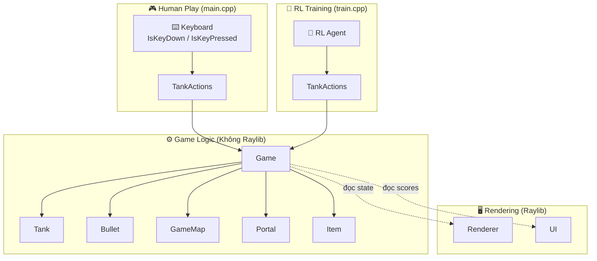

# AZ Tank Game — Kiến Trúc Mới

## Nguyên Tắc Thiết Kế

**Game logic tách hoàn toàn khỏi đồ họa.** Chỉ 3 file phụ thuộc Raylib: `main.cpp`, `renderer.cpp`, `ui.cpp`.

## Sơ Đồ Kiến Trúc



## Cấu Trúc File

| File | Phụ thuộc Raylib | Vai trò |
|---|:---:|---|
| `Constants.h` | ❌ | Hằng số, `PlayerConfig`, `TankActions` |
| `tank.h/.cpp` | ❌ | Logic xe tăng (nhận TankActions) |
| `bullet.h/.cpp` | ❌ | Logic đạn, tên lửa đuổi |
| `map.h/.cpp` | ❌ | Sinh mê cung Recursive Backtracker |
| `portal.h/.cpp` | ❌ | Cổng dịch chuyển A↔B |
| `item.h/.cpp` | ❌ | Hộp vũ khí (Box2D sensor) |
| `game.h/.cpp` | ❌ | **Game engine**: Update, ResetMatch |
| `renderer.h/.cpp` | ✅ | Vẽ tất cả game objects |
| `ui.h/.cpp` | ✅ | Settings, HUD, custom font |
| `main.cpp` | ✅ | Game loop human play |

## Luồng Dữ Liệu

```
Human:  Keyboard → main.cpp → TankActions → Game::Update() → Game State → Renderer::DrawWorld()
RL:     Agent    → train.cpp → TankActions → Game::Update() → Game State → (không cần render)
```

## TankActions — Input Trừu Tượng

```cpp
struct TankActions {
    bool forward, backward, turnLeft, turnRight;  // Di chuyển
    bool shoot;                                      // Bắn
    bool shield;                                     // Kích hoạt khiên
};
```

- **Human play**: `main.cpp` đọc `IsKeyDown(cfg.fw)` → `actions.forward = true`
- **RL training**: Agent output trực tiếp vào `actions`

## Cách Dùng cho RL Training

> [!TIP]
> Tạo file `train.cpp` riêng, chỉ include `game.h`. **Không cần Raylib, không cần cửa sổ.**

```cpp
// train.cpp — Ví dụ RL training headless
#include "game.h"

int main() {
    srand(42);
    Game game;
    game.numPlayers = 2;
    game.ResetMatch();

    for (int episode = 0; episode < 10000; episode++) {
        while (!game.needsRestart) {
            // Agent quyết định actions
            std::vector<TankActions> actions(game.numPlayers);
            actions[0].forward = true;  // ví dụ
            actions[1].shoot = true;    // ví dụ

            game.Update(actions, 1.0f / 60.0f);
        }
        // Episode kết thúc → reward = playerScores
        game.ResetMatch();
    }
}
```

> [!IMPORTANT]
> Khi build `train.cpp`, chỉ cần link Box2D, **không cần link Raylib** (trừ khi dùng Renderer để visualize).
